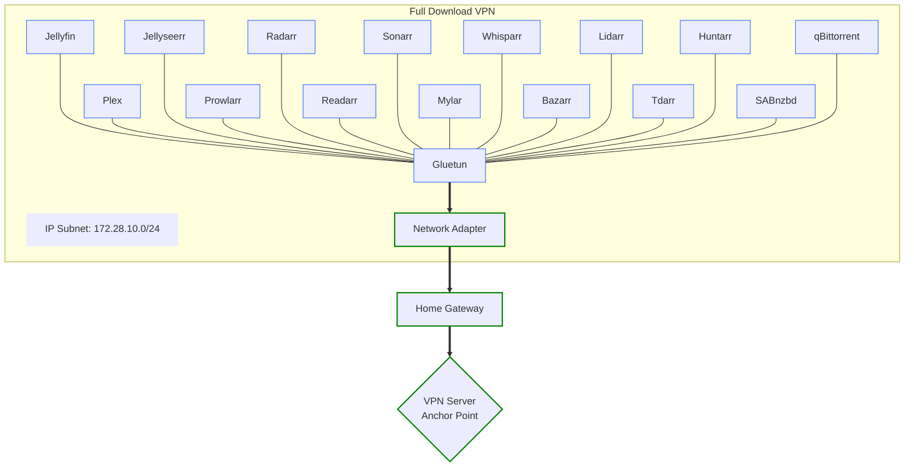

# MediaStack Project - Enhanced Management System

> **Original Project:** This project is based on the [MediaStack Project](https://github.com/geekau/mediastack) by **geekau**. All credit for the core MediaStack architecture, Docker configurations, and application integrations goes to the original author.
> 
> See the original project on [Reddit for MediaStack](https://www.reddit.com/r/MediaStack/)

## Enhanced Features Overview

This enhanced version adds a **comprehensive management system** to the original MediaStack project with:

- **🎯 Unified Management Interface** - Single script for all operations
- **🏥 Advanced Health Monitoring** - Real HTTP health checks with dynamic port detection
- **🎛️ Selective Service Control** - Whitelist-based service management
- **📁 Organized Project Structure** - Clean separation of scripts, compose files, and data
- **🔄 Smart Container Orchestration** - Intelligent dependency handling (Gluetun-first)
- **✅ Code Quality Assurance** - Shellcheck-compliant scripts with proper error handling
- **🎨 Enhanced User Experience** - Colored output, progress indicators, and detailed logging

## What Applications Are Provided In MediaStack  

Welcome to the MediaStack project! MediaStack is your ultimate solution for managing and streaming media collections with applications like Jellyfin and Plex. Using Docker, MediaStack containerises these media servers alongside *ARR applications (Radarr, Sonarr, Lidarr, etc.) for seamless media automation and management.  

List of Docker applications configured in the MediaStack `docker-compose.yaml` file:  


 </br>

<center>

| <center> Docker Application </center> | <center> Application Role </center> |  
|--------------------|------------------|  
| [Authentik](https://docs.goauthentik.io/docs/install-config/install/docker-compose) | Authentik is an open-source identity provider for SSO, MFA, and access control |  
| [Bazarr](https://docs.linuxserver.io/images/docker-bazarr) | Bazarr automates the downloading of subtitles for Movies and TV Shows |  
| [Chromium](https://docs.linuxserver.io/images/docker-chromium/) | Chromium is an an open-source web browser, allowing secure remote Internet browsing through your MediaStack |  
| [CrowdSec](https://docs.crowdsec.net/u/getting_started/installation/docker/) | CrowdSec is an open-source, collaborative intrusion prevention system that detects and blocks malicious IPs |  
| [DDNS-Updater](https://hub.docker.com/r/qmcgaw/ddns-updater) | DDNS-Updater automatically updates dynamic DNS records when your home Internet changes IP address |  
| [Filebot](https://www.filebot.net/) | FileBot is a tool for renaming and organising media files using online metadata sources |  
| [Flaresolverr](https://github.com/FlareSolverr/FlareSolverr) | Flaresolverr bypasses Cloudflare protection, allowing automated access to websites for scripts and bots |  
| [Gluetun](https://github.com/qdm12/gluetun-wiki) | Gluetun routes network traffic through a VPN, ensuring privacy and security for Docker containers |  
| [Grafana](http://docs.grafana.org/installation/docker/) | Grafana is an open-source analytics platform for visualising metrics, logs, and time-series data |  
| [Guacamole](https://hub.docker.com/r/guacamole/guacamole) | Guacamole is a clientless remote desktop gateway supporting RDP, VNC, and SSH through a web browser |  
| [Headplane](https://github.com/tale/headplane) | Headplane is a web-based user interface for managing Headscale, the self-hosted alternative to Tailscale |  
| [Headscale](https://headscale.net/stable/) | Headscale is an open-source, self-hosted alternative to Tailscale's control server for managing WireGuard-based VPNs |  
| [Heimdall](https://docs.linuxserver.io/images/docker-heimdall) | Heimdall provides a dashboard to easily access and organise web applications and services |  
| [Homarr](https://homarr.dev/docs/getting-started/after-the-installation) | Homarr is a self-hosted, customisable dashboard for managing and monitoring your server applications |  
| [Homepage](https://gethomepage.dev/latest/configs/) | Homepage is an alternate to Heimdall, providing a similar dashboard to easily access and organise web applications and services |  
| [Huntarr](https://github.com/plexguide/Huntarr.io) | Huntarr is an open-source tool that automates finding missing and upgrading media in *ARR libraries |  
| [Jellyfin](https://jellyfin.org/docs/general/administration/installing#docker) | Jellyfin is a media server that organises, streams, and manages multimedia content for users |  
| [Jellyseerr](https://hub.docker.com/r/fallenbagel/jellyseerr) | Jellyseerr is a request management tool for Jellyfin, enabling users to request and manage media content |  
| [Lidarr](https://docs.linuxserver.io/images/docker-lidarr) | Lidarr is a Library Manager, automating the management and meta data for your music media files |  
| [Mylar](https://github.com/mylar3/mylar3/wiki) | Mylar3 is a Library Manager, automating the management and meta data for your comic media files |  
| [Plex](https://hub.docker.com/r/linuxserver/plex) | Plex is a media server that organises, streams, and manages multimedia content across devices |  
| [Portainer](https://docs.portainer.io/start/install/server/docker) | Portainer provides a graphical interface for managing Docker environments, simplifying container deployment and monitoring |  
| [Postgresql](https://hub.docker.com/_/postgres) | PostgreSQL is a powerful, open-source relational database system known for reliability and advanced features |  
| [Prometheus](https://prometheus.io/docs/introduction/overview/) | Prometheus is an open-source monitoring system that collects and queries metrics using a time-series database |  
| [Prowlarr](https://docs.linuxserver.io/images/docker-prowlarr) | Prowlarr manages and integrates indexers for various media download applications, automating search and download processes |  
| [qBittorrent](https://docs.linuxserver.io/images/docker-qbittorrent) | qBittorrent is a peer-to-peer file sharing application that facilitates downloading and uploading torrents |  
| [Radarr](https://docs.linuxserver.io/images/docker-radarr) | Radarr is a Library Manager, automating the management and meta data for your Movie media files |  
| [Readarr](https://docs.linuxserver.io/images/docker-readarr) | is a Library Manager, automating the management and meta data for your eBooks and Comic media files |  
| [SABnzbd](https://docs.linuxserver.io/images/docker-sabnzbd) | SABnzbd is a Usenet newsreader that automates the downloading of binary files from Usenet |  
| [Sonarr](https://docs.linuxserver.io/images/docker-sonarr) | Sonarr is a Library Manager, automating the management and meta data for your TV Shows (series) media files |  
| [Tailscale](https://tailscale.com/) | Tailscale is a secure, peer-to-peer VPN that simplifies network access using WireGuard technology |  
| [Tdarr](https://docs.tdarr.io/docs/installation/docker/run-compose/) | Tdarr automates the transcoding and management of media files to optimise storage and playback compatibility |  
| [Traefik](https://doc.traefik.io/traefik/) | Traefik is a modern reverse proxy and load balancer for microservices and containerised applications with full TLS v1.2 & v1.3 support |  
| [Traefik-Certs-Dumper](https://hub.docker.com/r/ldez/traefik-certs-dumper) | Traefik Certs Dumper extracts TLS certificates and private keys from Traefik and converts for use by other services |  
| [Unpackerr](https://github.com/davidnewhall/unpackerr) | Unpackerr extracts and moves downloaded media files to their appropriate directories for organisation and access |  
| [Valkey](https://hub.docker.com/r/valkey/valkey) | Valkey is an open-source, high-performance, in-memory key-value datastore, serving as a drop-in replacement for Redis |  
| [Whisparr](https://wiki.servarr.com/whisparr) | Whisparr is a Library Manager, automating the management and meta data for your Adult media files |  

</br></br>

| <center>Ubuntu Linux Install - Docker Compose Build</center> | <center>Windows 11 Install - Docker with WSL and Ubuntu</center> |  
|----------------------------------------|----------------------------------------|  
| [](https://youtu.be/zz2XjrurgXI "MediaStack - A Detailed Installation Walkthru (Ubuntu Linux)") | [](https://youtu.be/N--e1O5SqPw "MediaStack - Ultimate Guide on Windows 11 Docker with WSL and Ubuntu") |  

</br>

</center>


## Network Architecture - Full Download VPN Configuration

This enhanced management system is specifically designed for the **"Full Download VPN"** configuration from the original MediaStack project. This setup routes all network traffic from Docker containers through the Gluetun VPN container for maximum privacy and security.

<center>



</center>

> **Key Architecture Benefits:**
> - **Maximum Privacy:** All container traffic routed through VPN encryption
> - **Intelligent Management:** Our scripts handle Gluetun dependency automatically
> - **Network Security:** VPN failure stops all container traffic (fail-safe design)
> - **Centralized Control:** Single VPN connection protects entire media stack

**For complete documentation** on VPN configurations, network architecture, and advanced features, visit the **[Original MediaStack Repository](https://github.com/geekau/mediastack)**.

## What Applications Are Provided In MediaStack  

Welcome to the MediaStack project! MediaStack is your ultimate solution for managing and streaming media collections with applications like Jellyfin and Plex. Using Docker, MediaStack containerises these media servers alongside *ARR applications (Radarr, Sonarr, Lidarr, etc.) for seamless media automation and management.

**Complete application list and original documentation available in the [Original Project README](README1.md)**

## Enhanced Directory Structure

```
/mnt/d/MediaStack/AppData/
├── data/                       # 📁 All container data (gitignored)
│   ├── gluetun/               # Container configurations and data
│   ├── radarr/                # (All service data folders)
│   ├── sonarr/
│   ├── jellyfin/
│   └── [20+ other services]/
├── compose/                    # 🐳 Docker Compose files
│   ├── docker-compose-gluetun.yaml
│   ├── docker-compose-radarr.yaml
│   ├── docker-compose-sonarr.yaml
│   └── [20+ other services].yaml
├── scripts/                    # 🛠️ Enhanced management scripts
│   ├── mediastack.sh          # ⭐ UNIFIED management script (all functionality)
│   ├── setup-directories.sh   # Automated directory setup
│   ├── pull-images.sh         # Docker image management
│   ├── start-stack.sh         # Intelligent service startup
│   ├── stop-stack.sh          # Graceful service shutdown
│   ├── update-stack.sh        # Update all services
│   ├── logs.sh                # Enhanced log viewing
│   └── status.sh              # Comprehensive status checking
├── mediastack.sh              # 🚀 Convenience launcher (main entry point)
├── docker-compose.env         # Environment configuration
├── services.whitelist         # 🎛️ Service selection configuration
└── .gitignore                 # Excludes data/ and sensitive configs
```

## Enhanced Management System Usage

### Unified Command Interface

The enhanced MediaStack provides a single entry point for all operations:

```bash
# Main management interface (recommended)
./mediastack.sh [command] [service]
```

### Core Commands

#### **Initial Setup**
```bash
./mediastack.sh setup           # Create directory structure automatically
./mediastack.sh pull            # Download all Docker images
./mediastack.sh start-all       # Start all services (Gluetun first)
```

#### **Daily Operations**
```bash
./mediastack.sh status          # Show container status with health checks
./mediastack.sh health          # Comprehensive health check with HTTP testing
./mediastack.sh list            # List all available services
./mediastack.sh logs [service]  # View logs for specific service
```

#### **Service Management**
```bash
# Individual service control
./mediastack.sh start [service]    # Start specific service
./mediastack.sh stop [service]     # Stop specific service  
./mediastack.sh restart [service]  # Restart specific service

# Bulk operations
./mediastack.sh start-all          # Start all services (intelligent ordering)
./mediastack.sh stop-all           # Stop all running services
./mediastack.sh restart-all        # Full restart (remove + recreate)
./mediastack.sh remove-all         # Stop and remove all containers
```

#### **Advanced Features**
```bash
./mediastack.sh update          # Update all services to latest images
./mediastack.sh whitelist       # Manage selective service control
./mediastack.sh help            # Show detailed command help
```

### Whitelist-Based Service Management

The enhanced system includes **selective service management** via `services.whitelist`:

```bash
# Enable whitelist mode
echo "prowlarr radarr sonarr jellyfin gluetun" > services.whitelist

# Only whitelisted services will be affected by:
./mediastack.sh start-all       # Starts only whitelisted services
./mediastack.sh restart-all     # Restarts only whitelisted services
```

**Note:** Individual service commands (`start [service]`, `stop [service]`) work on ALL services regardless of whitelist.

## Enhanced Features

### 🎯 **Unified Management System**
- **Single Entry Point:** All operations through one script (`./mediastack.sh`)
- **Comprehensive Commands:** Setup, management, monitoring, and maintenance
- **Intelligent Orchestration:** Smart dependency handling (Gluetun-first startup)

### 🏥 **Advanced Health Monitoring**
- **Real HTTP Health Checks:** Tests actual web service availability (not just ports)
- **Dynamic Port Detection:** Automatically reads ports from `docker-compose.env`
- **Comprehensive Status:** Container status + HTTP accessibility in one view
- **Health Command:** Dedicated health check with detailed reporting

### 🎛️ **Selective Service Control (Whitelist System)**
- **Service Selection:** Control which services are affected by bulk operations
- **Whitelist Configuration:** Simple file-based service selection (`services.whitelist`)
- **Flexible Management:** Individual services always accessible, bulk ops respect whitelist
- **Easy Configuration:** Add/remove services from automated management

### 📁 **Clean Project Organization**  
- **Separated Concerns:** Scripts, compose files, and data in dedicated folders
- **Git-Safe Structure:** Container data and configs excluded from version control
- **Automated Setup:** Directory structure created automatically
- **Environment-Driven:** All paths configurable via `docker-compose.env`

### 🔄 **Smart Container Orchestration**
- **Dependency Awareness:** Gluetun always starts first (VPN network priority)
- **Graceful Operations:** Proper start/stop sequences with error handling
- **Container-Aware Logic:** Works with actual running containers, not just compose files
- **Data Preservation:** Volumes and configurations persist across operations

### ✅ **Code Quality & Reliability**
- **Shellcheck Compliant:** All scripts pass static analysis
- **Proper Error Handling:** Robust error checking with `set -euo pipefail`
- **Quoted Variables:** Protection against path/space issues
- **Exit Code Management:** Proper error propagation (`|| exit 1` on critical commands)

### 🎨 **Enhanced User Experience**
- **Colored Output:** Easy-to-read status messages and progress indicators
- **Detailed Logging:** Comprehensive feedback for all operations
- **Help System:** Built-in documentation with `./mediastack.sh help`
- **Progress Feedback:** Clear indication of what the system is doing

## Implementation Details

### **Whitelist System**
The `services.whitelist` file controls which services are affected by bulk operations:

```bash
# Create whitelist with essential services
echo "gluetun prowlarr radarr sonarr jellyfin" > services.whitelist

# Bulk operations now only affect these services:
./mediastack.sh start-all    # Only starts whitelisted services
./mediastack.sh restart-all  # Only restarts whitelisted services

# Individual commands work on ALL services:
./mediastack.sh start plex   # Works regardless of whitelist
```

### **Health Check System**
Enhanced health monitoring with real HTTP testing:

```bash
./mediastack.sh health
# Output example:
# ✅ gluetun: Running (VPN connected)
# ✅ prowlarr: Running + HTTP accessible (http://192.168.1.100:9696)
# ❌ radarr: Running but HTTP not accessible (port 7878)
# ⚠️  jellyfin: Container stopped
```

### **Directory Management**
Automated directory creation with proper permissions:

```bash
./mediastack.sh setup
# Creates complete folder structure from docker-compose.env
# Sets proper ownership and permissions
# Handles Windows line endings in environment files
```

### **Project Migration Benefits**
Advantages of the enhanced structure:

- **📁 Clean Organization:** Container data moved to `data/` folder (gitignored)
- **🔄 Environment-Driven:** All paths from `docker-compose.env` variables
- **🚫 Git Safety:** Sensitive data excluded from version control
- **🛡️ Data Persistence:** Configurations survive container operations
- **🌐 VPN Priority:** Gluetun dependency handling for network security
- **📍 Relocatable:** Easy path changes via environment configuration

## Original MediaStack Documentation

For complete details about MediaStack applications, VPN configurations, remote access setup, and advanced features, see the **[Original Project Documentation](README1.md)**.

The original documentation includes:
- **Complete Application List** - All 30+ Docker applications with descriptions
- **VPN Network Configurations** - Full/Mini/No VPN setups
- **Security Features** - Traefik, Authentik, CrowdSec integration
- **Remote Access** - Tailscale mesh networking setup
- **Filesystem Mapping** - Media and data storage configuration
- **Advanced Configuration** - Headscale, authentication, and monitoring setup

## Contributing to Enhanced Features

This enhanced management system builds upon the excellent foundation of the original MediaStack project. The modifications focus on:

1. **Operational Excellence** - Making day-to-day management easier
2. **Code Quality** - Ensuring robust, maintainable scripts  
3. **User Experience** - Providing clear feedback and intuitive commands
4. **Selective Control** - Allowing granular service management

All enhancements preserve the original MediaStack architecture and are designed to be non-intrusive additions that improve usability while maintaining full compatibility with the base system.

---

**Credits:** Original MediaStack project by **geekau** - [GitHub Repository](https://github.com/geekau/mediastack)
